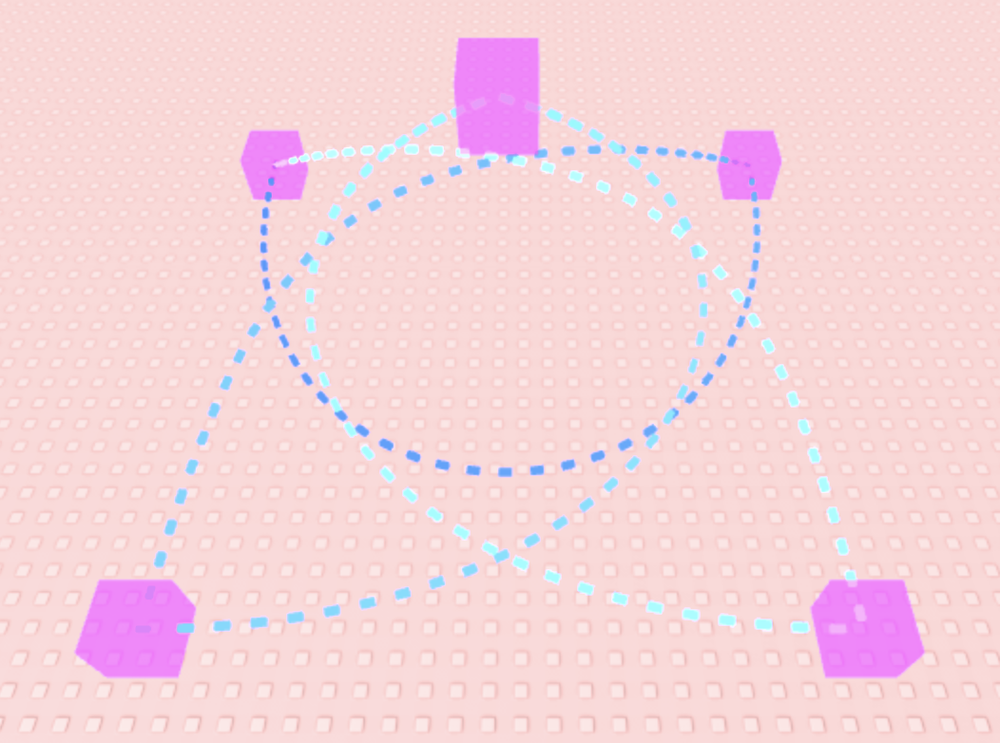

# Changelogs

## [v0.1.0] Bezier connection curve + fixed De Casteljau + Visualizer info | 2025/10/23

Added new base class `DynamicSegment`:
- Abstract class for dynamically updated route segments.
- Inherited from `RouteSegmentBase`.
- These segments have their data updated every frame.

Added new class `BezierConnectionCurve`:
- Dynamic bezier curve segment that joins two `RouteSegmentBase` segments with a given continuity.
- Inherited from `DynamicSegment`.
- [Continuity](https://en.wikipedia.org/wiki/Smoothness#Continuity) describes the smoothness of a function.
- Note that specifying high continuity might result in less ideal curves. (this may be a bug that can be fixed)

Updated `LinkedRoute` with additional segment functions:
- Static function `LinkedRoute.fromSegments` to construct a `LinkedRoute` directly from a table of route segments.
- `LinkedRoute:addConnectedSegment()` to add a route segment joined by a `BezierConnectionCurve` of a given continuity.
- `LinkedRoute:connectLoop()` to add a `BezierConnectionCurve` that joins the last segment with the first segment.

Fixed the implementation of [De Casteljau's algorithm](https://en.wikipedia.org/wiki/De_Casteljau%27s_algorithm) in `BezierCurve`:
- This reduces the time complexity for evaluating a position from [factorial time](https://en.wikipedia.org/wiki/Time_complexity#Factorial_time) to [polynomial](https://en.wikipedia.org/wiki/Time_complexity#Polynomial_time).

Combined the defaultPart and colorRange parameters for `RouteVisualizer` into a table:
- Field `templatePart`: the template `BasePart` that will be cloned.
- Field `colorRange`: the `Color3` range that will be applied to the created parts.
- If `nil` is given, a default configuration will be used.

Added antiderivative function to `BezierCurve`:
- Accessed through `BezierCurve:getAntiderivativeCurve()` and requires a `Vector3` argument `startAntiderivative`.
- This function is used by `BezierConnectionCurve` to generate connection curves of C2 continuity and above.

Modified some functions of `BezierCurve`:
- Getting the first (and higher) order derivative value of a curve with 0 or 1 control points will return `Vector3.zero` instead of erroring.
- Getting the position of a curve with 0 control points will error.

Among other small additions and fixes.

## [v0.0.1] Package fix + Resize parts for visualization | 2025/10/22

Fixed package problems by turning the `SegmentedRoute` folder into a package module.

Added a new parameter `autoResizePartLength` to the visualizer, which resizes & repositions parts so they connect each sampled position.

Also, the `createParts` visualizer functions now return both the parts `Folder` and a `table` of created parts.

| Without `autoResizePartLength` | With `autoResizePartLength` |
|:---:|:---:|
|  |  |

## [v0.0.0] Segmented Route Project | 2025/10/21

Created Segmented Route with four parts.

Implemented `RouteSegmentBase` parent class and `BezierCurve` inherited class.

Implemented `ControlPoint` class.

Implemented `LinkedRoute` class.

Implemented `RouteUtil` class with `RouteReparam` for reparameterization and `RouteVisualizer` for simple visualization.

