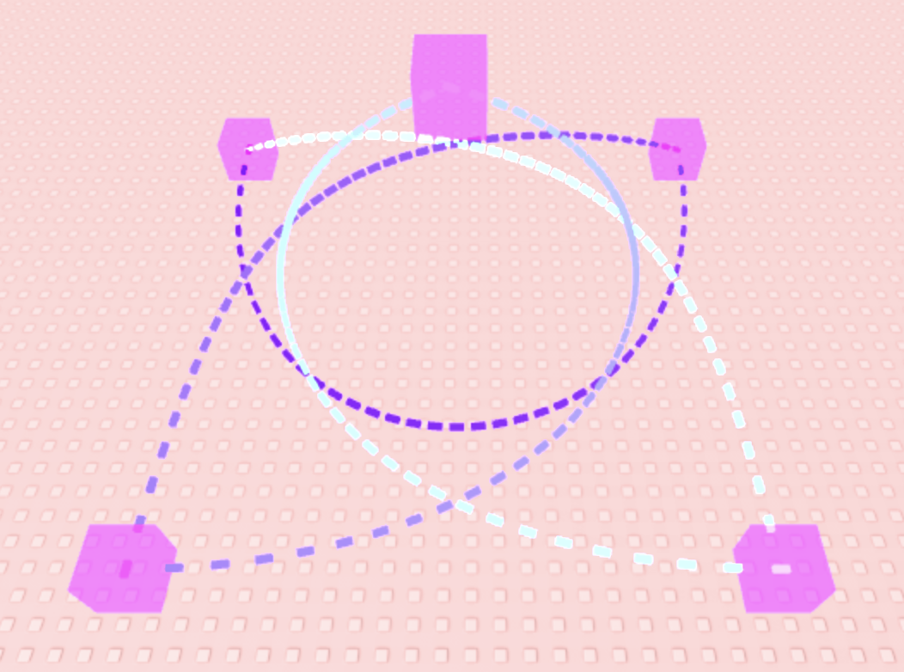
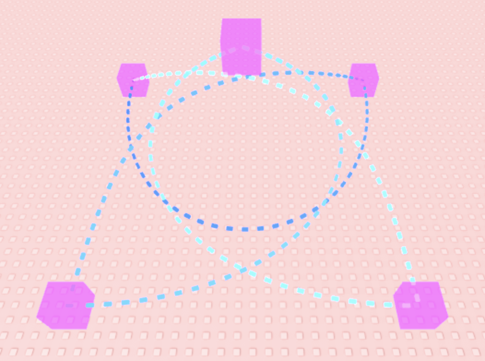
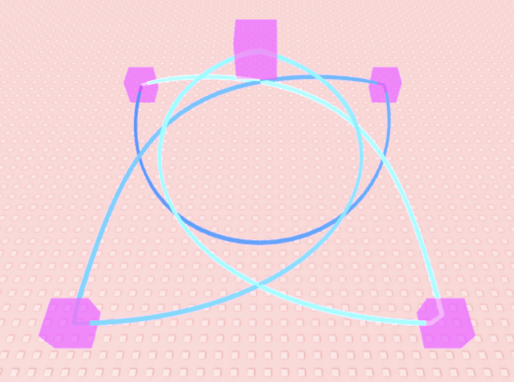

# Segmented Route

Create segments (linear / Bezier curves) and connect them into routes (paths / splines).

Segmented Route is a package of 4 parts:
- `ControlPoint`: a class for defining control point of different datatypes and retrieving its Vector3 position
- `RouteSegment`: a package for creating 3D segments, currently only Bézier curves
- `LinkedRoute`: a class for connecting segments ones after another
- `RouteUtil`: utility modules with extra functionalities like reparameterization and route visualization

## Example images

Some of the things you can do with SegmentedRoute!

| Equal alpha | Reparameterized by distance | With `autoResizeLength` |
|:---:|:---:|:---:|
|  |  |  |

| Connected with C1 continuity `BezierConnectionCurve` |
|:---:|
|  |

## Object-Oriented Programming (OOP) Design

There are two main ways to create and manage data `tables` with module script:
1) create a regular `table`, and manage the `table` using the module's functions with the `table` as first parameter
2) create a `metatable` with `__index` set to the module

Often, a decision on which to use depends on two factors: *inheritance* and remotely sending the `table`.

About 1):
- inheritance
  - module class can *inherit* from another module class, with some extra requirements:
    - the specific class of the created `table` needs to be stored as a field in the `table`
    - another module may be needed to interface with the `table` depending on the stored class
  - *inheritance* is hard to work with
- remote
  - you can send most `tables` remotely without problem

About 2):
- inheritance
  - module class can *inherit* from another module class
  - when calling function / methods:
    - use dot syntax to call a specific class's implementation
    - use colon syntax to call the overridden implementation
  - type checking can be hard and weird
- remote
  - when sending `tables` remotely, `metatable` will be lost
  - to reconstruct the `metatable`:
    - the specific class of the created `table` needs to be stored as a field in the `table`
    - another module can be used to reconstruct the object's `metatable` based on the stored class and data
